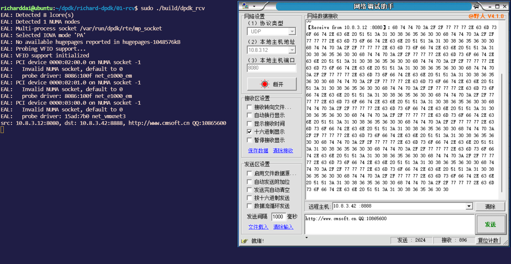

ubuntu16.04 dpdk-v19.08

# 1. dpdk软件安装


```shell
sudo apt install make gcc g++ gdb libnuma-dev git vim 
sudo ln -s /usr/bin/python3 /usr/bin/python
```


修改虚拟机

```
ethernet1.virtualDev = "e1000"
修改为
ethernet1.virtualDev = "vmxnet3"
```

vmxnet3支持多队列网卡


修改支持巨页

其次,通过命令sudo vim /etc/default/grub 将参数GRUB_CMDLINE_LINUX=""在其后面加上

```
default_hugepages=1G hugepagesz=2M hugepages=1024 isolcpus=0-2
```

再执行命令:sudo grub-mkconfig -o /boot/grub/grub.cfg

在 GRUB_CMDLINE_LINUX参数，添加 net.ifnames=0 biosdevname=0,使得网卡名称从0开始命名。

重启主机


# 2. dpdk环境

## 2.1 软件下载

```shell
git clone https://github.com/DPDK/dpdk.git
git checkout v19.08
git checkout -b v19.08
```

## 2.2 软件编译

进入dpdk目录：`cd dpdk` 然后执行`./usertools/dpdk-setup.sh` 选择39编译

```shell
----------------------------------------------------------
 Step 3: Run test application for linux environment
----------------------------------------------------------
[52] Run test application ($RTE_TARGET/app/test)
[53] Run testpmd application in interactive mode ($RTE_TARGET/app/testpmd)

----------------------------------------------------------
 Step 4: Other tools
----------------------------------------------------------
[54] List hugepage info from /proc/meminfo

----------------------------------------------------------
 Step 5: Uninstall and system cleanup
----------------------------------------------------------
[55] Unbind devices from IGB UIO or VFIO driver
[56] Remove IGB UIO module
[57] Remove VFIO module
[58] Remove KNI module
[59] Remove hugepage mappings

[60] Exit Script

Option: 39
```

## 2.3 igb_uio驱动安装

加载igb_uio驱动选择43

```
----------------------------------------------------------
[55] Unbind devices from IGB UIO or VFIO driver
[56] Remove IGB UIO module
[57] Remove VFIO module
[58] Remove KNI module
[59] Remove hugepage mappings

[60] Exit Script

Option: 43

Unloading any existing DPDK UIO module
Loading DPDK UIO module

Press enter to continue ...
```

## 2.4 网卡绑定

网卡绑定，选择49, 这里输入的不是网卡的命令，而是网卡的PCI地址：0000:03:00.0。我是将多队列网卡绑定上去了

```shell
----------------------------------------------------------
[55] Unbind devices from IGB UIO or VFIO driver
[56] Remove IGB UIO module
[57] Remove VFIO module
[58] Remove KNI module
[59] Remove hugepage mappings

[60] Exit Script

Option: 49


Network devices using kernel driver
===================================
0000:02:00.0 '82545EM Gigabit Ethernet Controller (Copper) 100f' if=ens32 drv=e1000 unused=igb_uio *Active*
0000:03:00.0 'VMXNET3 Ethernet Controller 07b0' if=ens160 drv=vmxnet3 unused=igb_uio 

No 'Baseband' devices detected
==============================

No 'Crypto' devices detected
============================

No 'Eventdev' devices detected
==============================

No 'Mempool' devices detected
=============================

No 'Compress' devices detected
==============================

No 'Misc (rawdev)' devices detected
===================================

Enter PCI address of device to bind to IGB UIO driver: 0000:03:00.0
OK

Press enter to continue ...
----------------------------------------------------------
```


如果看绑定成功没有，可以再次输入49。可以看到哪些网卡时用于dpdk，哪些网卡时用于linux kernel

```shell
Network devices using DPDK-compatible driver
============================================
0000:03:00.0 'VMXNET3 Ethernet Controller 07b0' drv=igb_uio unused=vmxnet3

Network devices using kernel driver
===================================
0000:02:00.0 '82545EM Gigabit Ethernet Controller (Copper) 100f' if=ens32 drv=e1000 unused=igb_uio *Active*

```


测试 输入53

```shell
----------------------------------------------------------
[55] Unbind devices from IGB UIO or VFIO driver
[56] Remove IGB UIO module
[57] Remove VFIO module
[58] Remove KNI module
[59] Remove hugepage mappings

[60] Exit Script

Option: 53


  Enter hex bitmask of cores to execute testpmd app on
  Example: to execute app on cores 0 to 7, enter 0xff
bitmask: 7
Launching app
EAL: Detected 8 lcore(s)
EAL: Detected 1 NUMA nodes
EAL: Multi-process socket /var/run/dpdk/rte/mp_socket
EAL: Selected IOVA mode 'PA'
EAL: No available hugepages reported in hugepages-1048576kB
EAL: Probing VFIO support...
EAL: PCI device 0000:02:00.0 on NUMA socket -1
EAL:   Invalid NUMA socket, default to 0
EAL:   probe driver: 8086:100f net_e1000_em
EAL: PCI device 0000:03:00.0 on NUMA socket -1
EAL:   Invalid NUMA socket, default to 0
EAL:   probe driver: 15ad:7b0 net_vmxnet3
Interactive-mode selected
testpmd: create a new mbuf pool <mbuf_pool_socket_0>: n=163456, size=2176, socket=0
testpmd: preferred mempool ops selected: ring_mp_mc

Warning! port-topology=paired and odd forward ports number, the last port will pair with itself.

Configuring Port 0 (socket 0)
Port 0: 00:50:56:2F:63:B6
Checking link statuses...
Done
testpmd>
```

输入show port info 0显示网卡信息

```shell
testpmd> show port info 0

********************* Infos for port 0  *********************
MAC address: 00:50:56:2F:63:B6
Device name: 0000:03:00.0
Driver name: net_vmxnet3
Connect to socket: 0
memory allocation on the socket: 0
Link status: up
Link speed: 10000 Mbps
Link duplex: full-duplex
MTU: 1500
Promiscuous mode: enabled
Allmulticast mode: disabled
Maximum number of MAC addresses: 1
Maximum number of MAC addresses of hash filtering: 0
VLAN offload: 
  strip off 
  filter off 
  qinq(extend) off 
Supported RSS offload flow types:
  ipv4
  ipv4-tcp
  ipv6
  ipv6-tcp
Minimum size of RX buffer: 1646
Maximum configurable length of RX packet: 16384
Current number of RX queues: 1
Max possible RX queues: 16
Max possible number of RXDs per queue: 4096
Min possible number of RXDs per queue: 128
RXDs number alignment: 1
Current number of TX queues: 1
Max possible TX queues: 8
Max possible number of TXDs per queue: 4096
Min possible number of TXDs per queue: 512
TXDs number alignment: 1
Max segment number per packet: 255
Max segment number per MTU/TSO: 16
```


输入quit可以退出

# 3. 运行dpdk程序

环境变量设置：

```c
export RTE_SDK=/home/richarddai/dpdk
export RTE_TARGET=x86_64-native-linux-gcc
```

放入到.bashrc最后，然后执行source ~/.bashrc

进入`examples/helloworld`目录执行`make`

再执行`sudo ./build/helloworld`

```shell
$ sudo ./build/helloworld 
EAL: Detected 8 lcore(s)
EAL: Detected 1 NUMA nodes
EAL: Multi-process socket /var/run/dpdk/rte/mp_socket
EAL: Selected IOVA mode 'PA'
EAL: No available hugepages reported in hugepages-1048576kB
EAL: Probing VFIO support...
EAL: PCI device 0000:02:00.0 on NUMA socket -1
EAL:   Invalid NUMA socket, default to 0
EAL:   probe driver: 8086:100f net_e1000_em
EAL: PCI device 0000:03:00.0 on NUMA socket -1
EAL:   Invalid NUMA socket, default to 0
EAL:   probe driver: 15ad:7b0 net_vmxnet3
hello from core 1
hello from core 2
hello from core 3
hello from core 4
hello from core 5
hello from core 6
hello from core 7
hello from core 0
```


# 4. dpdk-rcv

代码https://github.com/adaptrum-richard/dpdk-practice/releases/tag/01-rcv

需要windows设置arp表，找到对应的ip地址。[添加步骤参考](https://github.com/adaptrum-richard/dpdk-practice/blob/main/01-rcv/arp.txt)

执行结果：

